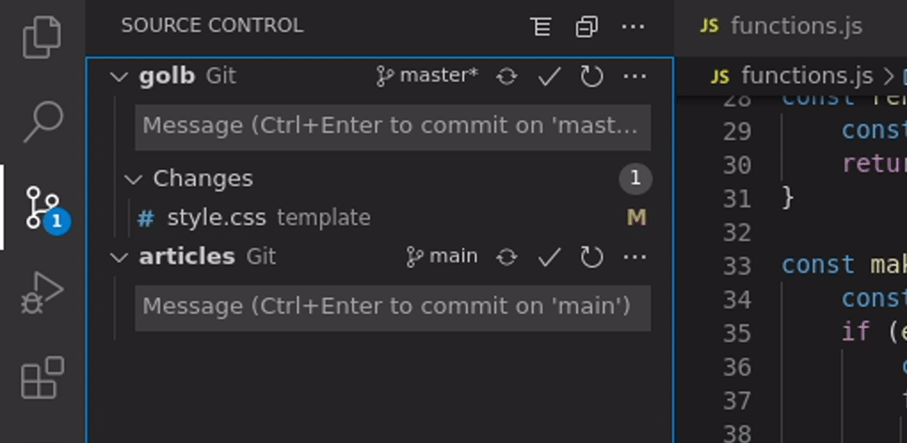

# GitHub

## Guides

- [GIT on GitHub](https://githubtraining.github.io/training-manual/#/?id=welcome-to-github)
- [GIT Cheat Sheet/](https://training.github.com/downloads/github-git-cheat-sheet/)

## Vocabulaire

### `Git` c'est quoi ?

Git est un logiciel de gestion de versions décentralisé.([Wikipedia](https://fr.wikipedia.org/wiki/Git))

[Site de Git](https://git-scm.com/)

> [Vidéo d'explication](https://youtu.be/hwP7WQkmECE)

### `GitHub` c'est quoi ?

GitHub est un **service web d'hébergement** et de gestion de développement de logiciels, utilisant le logiciel de gestion de versions `Git`. ([Wikipedia](https://fr.wikipedia.org/wiki/GitHub))

---

## Command GIT sur Visual Studio

### Commandes GIT

`git pull` : permet de récuperer en local les dernières modifications

`git checkout BRANCH_NAME` : permet de changer de branche

`git branch BRANCH_NAME` : permet de créer une branche

`git shortlog -sn` : Liste les commiters et le nombre de commit

### Faire une commit

- Aller dans l'onglet `Source Control`



Traduit en commande :

```sh
# git init
# git remote add origin URL_HERE
git add template/style.css # il est dans le dossier template
git commit -m "[feature] add css"
git push
```

> - for the first push : `git push -u origin main`

## Submodules

Dans un repository, on peut mettre des liens vers d'autres repo, puis on clone en faisant

```sh
git submodule update --recursive --init
```

## Links

- [https://ohshitgit.com/](https://ohshitgit.com/)

## Reset history of a repo

```sh
git checkout --orphan newBranch
git add -A  # Add all files and commit them
git commit
git branch -D master  # Deletes the master branch
git branch -m master  # Rename the current branch to master
git push -f origin master  # Force push master branch to github
git gc --aggressive --prune=all     # remove the old files
```

> - [https://stackoverflow.com/a/13102849](https://stackoverflow.com/a/13102849)

## See public ssh keys

```url
https://github.com/USERNAME.keys
https://gitlab.com/USERNAME.keys
```

## GIT config

```sh
# show the config
git config --list --global

# change the config
git config --global user.name "n4n5"
```

## pre-commit

```sh
# install pre-commit
python -m pip install -u pre-commit
# install pre-commit hook
python -m pre_commit install

# useful command
python -m pre_commit run --all-files
```

## Add multiple push URLs

```sh
git remote set-url --add --push [remote] [original_repo_URL]
git remote set-url --add --push [remote] [second_repo_URL]
git remote -v
```

## Change commit date

```sh
changeCommitDate() {
  VARIABLE="${1:-3}"
  printf 'DAT=$(date --date "%s days ago" -R) GIT_AUTHOR_DATE=$DAT GIT_COMMITTER_DATE=$DAT git commit -m "message"\n' "$VARIABLE"
}
```
