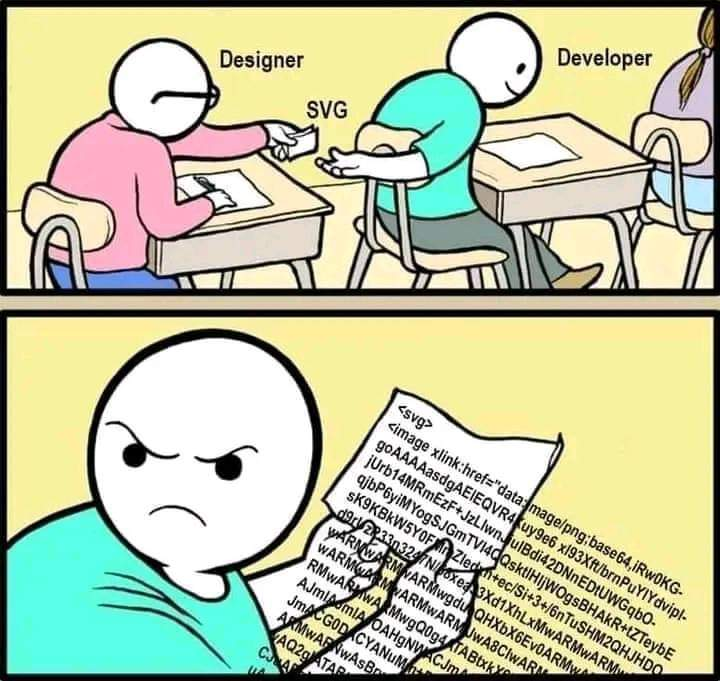

# Web knowledge

## Google highlight search

We can highlight text in a page with Chrome using a special hash/anchor :

```txt
#:~:text=
```

> The hash/anchor isn't stocked in `window.location.hash` !

Example of URL :

```txt
https://website.com/page#:~:text=text%20to%20highlight%20here
```

[Example](https://github.com/Its-Just-Nans#:~:text=You%20can%20check%20my%20github%20website)

## See developer tool of the Discord client

In `"DANGEROUS_ENABLE_DEVTOOLS_ONLY_ENABLE_IF_YOU_KNOW_WHAT_YOURE_DOING": true` in `~/.config/discord/settings.json`

- [https://www.reddit.com/r/discordapp/comments/sc61n3/comment/hu4fw5x](https://www.reddit.com/r/discordapp/comments/sc61n3/comment/hu4fw5x/)

## Don't do that



## Random links

- [https://www.matematica.pt/fr/utile/formules-math.php](https://www.matematica.pt/fr/utile/formules-math.php)
- [http://www-igm.univ-mlv.fr/~dr/expose.php](http://www-igm.univ-mlv.fr/~dr/expose.php)
- [https://web.maths.unsw.edu.au/~lafaye/CCM/](https://web.maths.unsw.edu.au/~lafaye/CCM/)
- [http://broussaille.free.fr/cours/couleurs/index.htm](http://broussaille.free.fr/cours/couleurs/index.htm) - colors
- [http://deptinfo.cnam.fr/Enseignement/Memoires/LUSTEAU.Franck/Pages/Les_codages.htm](http://deptinfo.cnam.fr/Enseignement/Memoires/LUSTEAU.Franck/Pages/Les_codages.htm)
- [https://app.senecalearning.com/courses](https://app.senecalearning.com/courses)
- [http://i3s.unice.fr/~sassatelli/teaching.html](http://i3s.unice.fr/~sassatelli/teaching.html)
- [http://i3s.unice.fr/~fpayan/teaching.html](http://i3s.unice.fr/~fpayan/teaching.html)
- [http://users.polytech.unice.fr/~karima/teaching/](http://users.polytech.unice.fr/~karima/teaching/)
- [CUT101](https://www.youtube.com/watch?v=OAH0MoAv2CI) - Cuts & Transitions 101
- [Cours techno](https://www.courstechinfo.be/)
