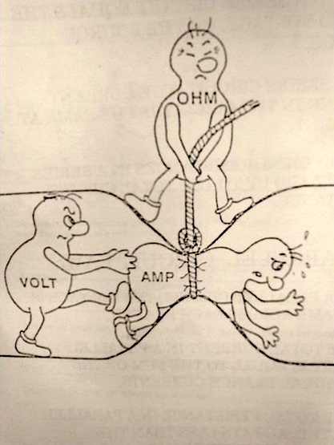

# Electricity

## Diviseur de tension

Les tensions du diviseur sont reliées a la masse et les
deux résistances R1 et R2 sont connectées en série.

Une tension U est appliquée en entrée sur ces deux résistances et la tension de sortie est mesurée aux bornes de Rg. En utilisant la loi des mailles puis la loi d'Ohm avec les tensions U et U2, il est possible de déduire la relation entre la tension de sortie `U2` et la tension d'entrée `U` : `U = I*(R1+R2)` et `U2 = R2*I`, on peut écrire :

```latex
U_{2} = \frac{U \cdot R_{2}}{R_{2}+R_{2}}
```

## Diviseur de courant

La formule du diviseur de courant permet de calculer l'intensité du courant dans une résistance lorsque celle-ci fait partie d'un ensemble de résistances en parallèle et lorsque l'on connaît le courant total qui alimente cet ensemble.

Ainsi, si on prend un noeud simple et 2 branches dont les résistances sont `R1` et `R2`, alors si on note `Y = 1/R` la conductance, on peut écrire :

```latex
I_{1} = \frac{1 \cdot Y_{1}}{Y_{1}+Y_{2}}
```

## Théorème de Millman

Dans un réseau électrique de branches en paralléle, comprenant chacune un générateur de tension parfait en série avec un élément linéaire, la tension aux bornes des branches est égale a la somme des forces électromotrices respectivement multipliées par l'admittance de la branche, le tout divisé par la somme des admittances.

L'admittance, notée `Y`, est l'inverse de l'impédance `Z`. Elle se mesure en siemens (`S`). On a: `Y = 1/Z` avec `Z` en ohm (`Ω`).

## Les lois de Kirchhoff

Ce sont des propriétés physiques qui s'appliquent sur les circuits électriques. Ces lois portent le nom du physicien allemand Gustav Kirchhoff qui les a établies en 1845. Les deux lois de Kirchhoff sont :

- La loi des noeuds : la somme algébrique des intensités des courants qui entrent par un noeud est égale a la somme algébrique des intensités des courants qui en sortent
- La loi des mailles : dans une maille d'un réseau électrique, la somme des tensions le long de cette maille est toujours nulle. En d'autres termes, si on fait le tour d'une maille et que l'on additionne toutes les tensions de celle-ci (en faisant attention au sens), la somme sera égale a zéro.

## Théorème de superposition

Dans un circuit linéaire, le courant produit par plusieurs sources de courants indépendantes est égale a la somme des courants produits par chaque source prise isolément.

## Théorème de Thévenin

Tout sous-réseau d'un réseau peut être remplacé par un générateur de tension et une résistance en série avec ce générateur.

Méthode pour trouver le générateur de Thévenin :

1. Isoler le réseau (c'est a dire retirer tous les éléments qui ne font pas partis du sous réseau pour lequel on désire connaître le générateur de Thévenin).
2. Remplacer les sources de tension par des courts circuits et les sources de courant par des circuits ouverts.
3. Calculer la résistance de Thévenin (la résistance équivalente du circuit).
4. Rebrancher les sources (annuler l'étape 2).
5. Calculer la tension de Thévenin (tension équivalente entre les deux bornes du réseau pour lequel on cherche le générateur de Thévenin).

## Théorème de Norton

Tout sous-réseau d'un réseau peut être remplacé par un générateur de courant et une résistance en parallèle avec ce générateur.

## Electricity pic



- [http://ahistace.chez-alice.fr/documents/Chapitre1Fondamentaux.pdf](http://ahistace.chez-alice.fr/documents/Chapitre1Fondamentaux.pdf)
- [http://digital.r2.enst.fr/](http://digital.r2.enst.fr/) - ELECINF simulator
