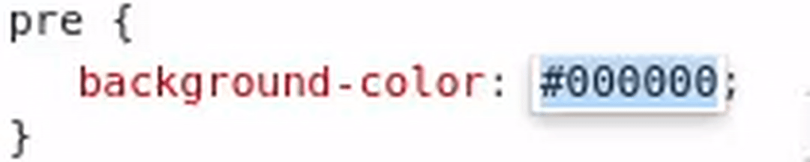
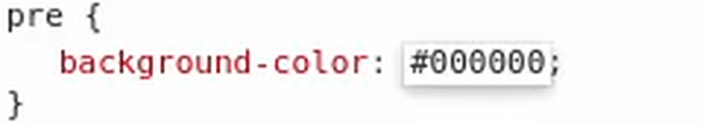
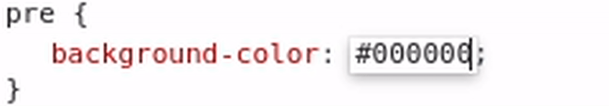

# HTML && CSS

## Can be useful

```css
pre {
    white-space: pre-wrap;
}
* {
    box-sizing: border-box;
}
#content {
    overflow-wrap: break-word;
}
```

## Keyboard shortcuts to increase or decrease easily a color value in the Chrome Dev Tools

To increase use ARROW_UP, to decrease use ARROW_DOWN

- `ARROW_UP + ALT` to increase the two hexadecimals on the right

<details>



</details>

- `ARROW_UP + SHIFT` to increment the middle two hexadecimals

<details>



</details>

- `ARROW_UP + CTRL` to increment the left two hexadecimals

<details>


</details>

- `ARROW_UP + CTRL + SHIFT + ALT` to increment all hexadecimals pairs

<details>



</details>

## SEO

- replace `{title}`, `{desc}`, `{key}`, `{url}`, `{img}`, `{domain}`, `{keywords}` with the corresponding values

```html
<meta charset="UTF-8" />
<meta name="viewport" content="width=device-width, initial-scale=1.0" />
<title>{title}</title>
<meta name="description" content={desc} />
<meta name="keywords" content={keywords} />
<link rel="icon" href="/favicon.ico" />
<meta name="google-site-verification" content={key} />

<meta property="og:url" content={url} />
<meta property="og:type" content="website" />
<meta property="og:title" content={title} />
<meta property="og:description" content={desc} />
<meta property="og:image" content={img} />

<meta name="twitter:card" content="summary_large_image" />
<meta property="twitter:domain" content={domain} />
<meta property="twitter:url" content={url} />

<meta name="twitter:title" content={title} />
<meta name="twitter:description" content={desc} />
<meta name="twitter:image" content={img} />
```

- add a `sitemap.xml` to the root of the website

## Google highlight search

We can highlight text in a page with Chrome using a special hash/anchor :

```txt
#:~:text=
```

> The hash/anchor isn't stocked in `window.location.hash` !

Example of URL :

```txt
https://website.com/page#:~:text=text%20to%20highlight%20here
```

[Example](https://github.com/Its-Just-Nans#:~:text=Hi%20There)
